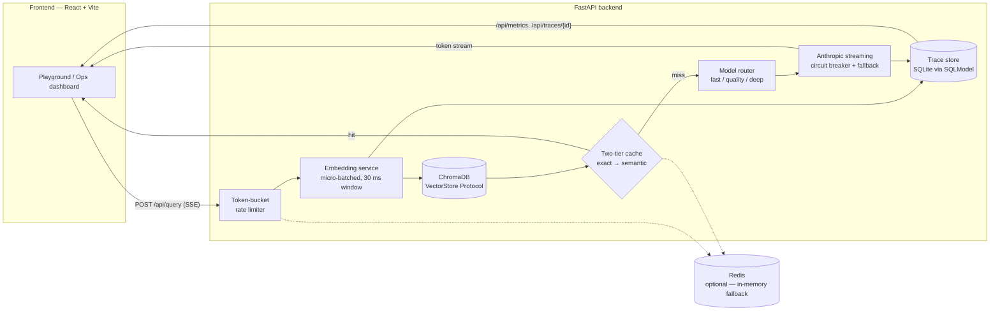

# Glasshouse

**A RAG inference platform whose entire purpose is making the pipeline visible.**

Most RAG demos are a chatbot with a search index behind it. This one shows you the
machine room. Every query travels a measured pipeline — embedding → retrieval →
cache → routing → generation — and the UI renders that journey live: per-stage
latency, cache hit tier and similarity score, which model answered, how many tokens
it burned, and what it cost. When something degrades (Redis down, primary model
failing), Glasshouse doesn't hide it — it falls back and tells you, on screen, that
it did.

## Architecture



Every request produces a structured trace (`RequestTrace` in
`backend/app/services/observability.py`): per-stage milliseconds, cache status,
model used, fallback flag, tokens in/out, cost in USD, and the retrieved chunk IDs.
Traces persist to SQLite and power both the trace replay view and the Ops metrics
(p50/p95/p99, cache hit rate, cost, model breakdown).

## Features

- **Two-tier response cache** — exact match (SHA-256 of the normalized query, Redis
  with TTL) plus semantic match (cosine similarity ≥ 0.80 against cached query
  embeddings, plus a lexical polarity check so a negated question can never be
  served an affirmative answer). Both numbers are measured, not guessed —
  [ADR-002](docs/adr/002-semantic-cache-tier.md) shows the bands and why the
  intuitive 0.95 made the tier dead code. Falls back to an in-memory LRU when
  Redis is absent.
- **Structure-aware chunking and relative score gating** — chunks split on
  document structure (never across a heading) rather than fixed word windows, and
  retrieval keeps chunks scoring within 55% of the top hit instead of clearing a
  fixed threshold. This is where the first version was genuinely broken; the
  measurements are in [ADR-006](docs/adr/006-chunking-and-relative-score-gating.md).
- **Model router with fallback** — routes to `fast` (Haiku) / `quality` (Sonnet) /
  `deep` (Opus) tiers by query length or user hint; on failure it walks the
  remaining tiers and flags `fallback_triggered` in the trace. It will not fall
  back mid-stream once tokens have been emitted, since that would append a second
  complete answer to a partial one.
- **Micro-batched embeddings** — concurrent embed requests are queued and flushed
  every 30 ms as one batch, so bursty traffic pays one model call instead of N.
  Runs `all-MiniLM-L6-v2` locally via ONNX runtime by default (no PyTorch
  install) — see [ADR-005](docs/adr/005-onnx-embeddings.md).
- **Token-bucket rate limiting** — per-session bucket (100 tokens, 10/s refill),
  executed atomically in Redis via a Lua script, with an in-memory fallback.
  Rejects with a real HTTP **429 + `Retry-After`** before the stream opens, and is
  counted separately from `error_rate`, because a 429 is the limiter working.
- **Structured per-request traces** — every stage timed, every cost accounted,
  every trace replayable at `GET /api/traces/{request_id}`.
- **Circuit breaker** — 3 consecutive failures open the breaker for a tier;
  a 30-second cooldown before retry, so a dying upstream isn't hammered.
- **SSE streaming** — retrieval results, cache verdict, LLM tokens, and the final
  trace all stream over one server-sent-events response.
- **Graceful degradation everywhere** — no Redis? In-memory fallback. Vector store
  errors? Answer without context. Primary model down? Fallback tier, clearly
  labeled in the UI.

## Setup (under 5 minutes)

**Prerequisites:** Python 3.12, Node 18+, and optionally Docker (only for Redis).

### Backend

```bash
cd backend
python -m venv .venv
source .venv/bin/activate        # Windows: .venv\Scripts\activate
pip install -r requirements.txt
cp .env.example .env             # then put your ANTHROPIC_API_KEY in .env
uvicorn app.main:app --reload
```

The API is now on `http://localhost:8000`. First startup downloads the
`all-MiniLM-L6-v2` embedding model (~80 MB) — embeddings run locally via ONNX
runtime, so the Anthropic key is the only credential you need and PyTorch is not
installed. (If you specifically want the PyTorch/sentence-transformers backend,
`pip install -r requirements-torch.txt` and set `EMBEDDING_PROVIDER=sentence-transformers`.
Same model, same 384-dim vectors, ~2.5 GB more download.)

### Frontend

```bash
cd frontend
npm install
npm run dev
```

Open the Vite dev server URL it prints (default `http://localhost:5173`); it
proxies `/api` to port 8000. For a single-origin setup, `npm run build` instead —
the backend serves `frontend/dist` at `http://localhost:8000` with no proxy and no
CORS involved.

### Try it immediately

Two sample documents are included so there's something to ask about. Run these
from the repo root (the previous two sections leave you inside `backend/` or
`frontend/`):

```bash
curl -F "file=@samples/orbital-mechanics-notes.md" http://localhost:8000/api/documents
curl -F "file=@samples/meridian-release-notes.pdf" http://localhost:8000/api/documents
```

Then ask "How much water does life support recycle?" or "What did incremental
linking improve?" — the second exercises the PDF path.

### Optional: Redis

```bash
docker-compose up redis
```

**Glasshouse runs fine without Redis and without Docker.** At startup the backend
pings `REDIS_URL`; if it's unreachable it logs a warning and switches the cache to
an in-memory LRU and the rate limiter to in-memory buckets. Redis just makes those
layers durable and shared.

## How to demo this in an interview

A five-minute script that touches every subsystem:

1. **Upload a PDF** in the left document rail. Watch it get chunked, embedded
   (micro-batched), and upserted into Chroma.
2. **Ask a question.** The pipeline trace animates left to right — Embed →
   Retrieve → Cache → Generate — and each segment's draw time is the *real
   measured latency* of that stage. The answer streams in with retrieved-chunk
   cards and a cost/token receipt.
3. **Ask the exact same question again.** The cache badge flips to `hit_exact`,
   the trace terminates at the cache node, and the receipt shows ~0 ms of LLM time
   and $0.00 cost.
4. **Ask a paraphrase** ("How much water is recycled?" → "What fraction of water
   gets reclaimed?"). The badge shows `hit_semantic` with the cosine similarity
   that cleared the 0.80 threshold — no LLM call, no cost. Then ask the *negated*
   form and watch it correctly **miss**: that case scores 0.825, inside the
   paraphrase band, so it's caught by the polarity guard rather than the
   threshold. This is the best 60 seconds in the demo — see
   [ADR-002](docs/adr/002-semantic-cache-tier.md).
5. **Run the load test** from the Ops dashboard (or
   `cd backend && python load_test.py --concurrency 20 --duration 30`). Watch requests/sec,
   p50/p95/p99, and cache hit rate move live. Push concurrency high enough and
   429s appear — counted separately from errors, so `error_rate` stays 0.00 while
   the platform sheds load. `python verify_rate_limit.py` proves that directly.
6. **Open a trace replay.** Pick any request and walk through its stage-by-stage
   waterfall: where the milliseconds went, which model answered, whether a
   fallback fired.

Then open `ARCHITECTURE.md` and talk through *why* each layer exists — that
document is written to be read aloud.
