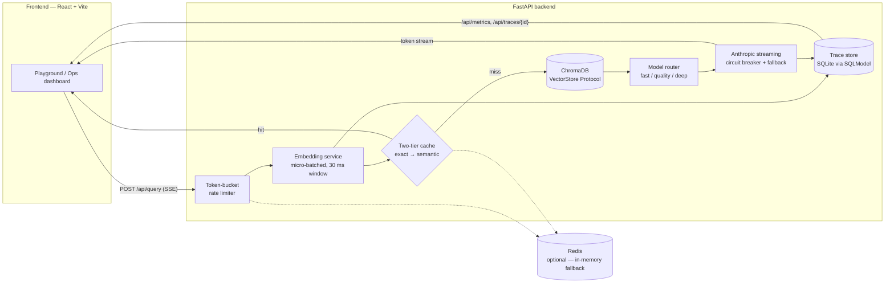

# Glasshouse

**A RAG inference platform whose entire purpose is making the pipeline visible.**

Most RAG demos are a chatbot with a search index behind it. This one shows you the
machine room. Every query travels a measured pipeline — embedding → retrieval →
cache → routing → generation — and the UI renders that journey live: per-stage
latency, cache hit tier and similarity score, which model answered, how many tokens
it burned, and what it cost. When something degrades (Redis down, primary model
failing), Glasshouse doesn't hide it — it falls back and tells you, on screen, that
it did.

## Architecture



The cache sits *before* retrieval, not after it. A cache exists to skip
downstream work, so consulting it after the vector search would mean paying for
a search whose answer was already known. The query is embedded exactly once and
that single vector is used for both the semantic cache lookup and the vector
search.

Every request produces a structured trace (`RequestTrace` in
`backend/app/services/observability.py`): per-stage milliseconds, cache status,
model used, fallback flag, tokens in/out, cost in USD, and the retrieved chunk IDs.
Traces persist to SQLite and power both the trace replay view and the Ops metrics
(p50/p95/p99, cache hit rate, cost, model breakdown).

## Features

- **Two-tier response cache** — exact match (SHA-256 of the normalized query, Redis
  with TTL) plus semantic match (cosine similarity ≥ 0.80 against cached query
  embeddings, plus a lexical polarity check so a negated question can never be
  served an affirmative answer). Both numbers are measured, not guessed —
  [ADR-002](docs/adr/002-semantic-cache-tier.md) shows the bands and why the
  intuitive 0.95 made the tier dead code. Falls back to an in-memory LRU when
  Redis is absent. Retrieved chunks are cached alongside the answer, so a hit
  skips the vector search outright and still fills the retrieval panel.
- **Structure-aware chunking and relative score gating** — chunks split on
  document structure (never across a heading) rather than fixed word windows, and
  retrieval keeps chunks scoring within 55% of the top hit instead of clearing a
  fixed threshold. This is where the first version was genuinely broken; the
  measurements are in [ADR-006](docs/adr/006-chunking-and-relative-score-gating.md).
- **Model router with fallback** — routes to `fast` / `quality` / `deep` tiers by
  user hint or query length; on failure it walks the remaining tiers and flags
  `fallback_triggered` in the trace. It will not fall back mid-stream once tokens
  have been emitted, since that would append a second complete answer to a
  partial one. Tiers default to Haiku / Sonnet / Opus, but the provider is
  swappable — see [Running without an Anthropic key](#running-without-an-anthropic-key).
- **Micro-batched embeddings** — concurrent embed requests are queued and flushed
  every 30 ms as one batch, so bursty traffic pays one model call instead of N.
  Runs `all-MiniLM-L6-v2` locally via ONNX runtime by default (no PyTorch
  install) — see [ADR-005](docs/adr/005-onnx-embeddings.md).
- **Token-bucket rate limiting** — two buckets, both of which must have budget:
  a tight per-session one (100 tokens, 10/s refill) and a looser per-IP backstop
  (400, 40/s). Both are checked and debited all-or-nothing in one atomic Redis
  Lua call, with an in-memory fallback. The IP dimension exists because
  `session_id` comes from the client, so a session-only limit is defeated by
  rotating it. Rejects with a real HTTP **429 + `Retry-After`** before the stream
  opens — the wait is computed from the budget actually remaining in the
  tightest bucket — and is counted separately from `error_rate`, because a 429
  is the limiter working.
- **Grounded answers with citations** — the system prompt confines the model to
  the retrieved passages, numbers them so the answer can cite `[1]`/`[2]`, and
  requires it to say it doesn't know rather than fall back on training data.
  Answering a retrieval miss confidently is the worst failure a RAG system has.
- **Structured per-request traces** — every stage timed (`embed_ms`, `cache_ms`,
  `retrieval_ms`, `llm_ms`), every cost accounted, every trace replayable at
  `GET /api/traces/{request_id}`. `GET /api/health` reports the state of the
  optional dependencies.
- **Circuit breaker that can tell a bad upstream from a bad request** — 3
  consecutive *transient* failures open a tier for 30 seconds. Permanent errors
  (401, 400, 404) neither trip the breaker nor walk the fallback chain: a bad
  API key fails identically on all three tiers, so retrying only triples the
  latency and buries the one message worth reading.
- **SSE streaming** — retrieval results, cache verdict, LLM tokens, and the final
  trace all stream over one server-sent-events response.
- **Graceful degradation everywhere** — no Redis? In-memory fallback. Vector store
  errors? Answer without context. Primary model down? Fallback tier, clearly
  labeled in the UI.

## Run it with one command

```bash
docker compose up
```

Then open `http://localhost:8000`. The image builds the frontend and serves it
from the backend, so there is one process, one port and no CORS. The ~80 MB
embedding model is baked in at build time rather than downloaded on first
query. Redis comes up alongside it, though the app runs fine without it.

Generation needs a key — set `ANTHROPIC_API_KEY`, or point `LLM_PROVIDER=openai`
at a free tier (see [Running without an Anthropic key](#running-without-an-anthropic-key)).
Retrieval, chunking, caching and the whole trace work with no key at all.

CI builds this image on every push, boots it, and runs a query through it, so
the claim above is tested rather than asserted.

## Setup (under 5 minutes)

**Prerequisites:** Python 3.12, Node 18+, and optionally Docker (only for Redis).

### Backend

```bash
cd backend
python -m venv .venv
source .venv/bin/activate        # Windows: .venv\Scripts\activate
pip install -r requirements.txt
cp .env.example .env             # then put your ANTHROPIC_API_KEY in .env
uvicorn app.main:app --reload
```

The API is now on `http://localhost:8000`. First startup downloads the
`all-MiniLM-L6-v2` embedding model (~80 MB) — embeddings run locally via ONNX
runtime, so the Anthropic key is the only credential you need and PyTorch is not
installed. (If you specifically want the PyTorch/sentence-transformers backend,
`pip install -r requirements-torch.txt` and set `EMBEDDING_PROVIDER=sentence-transformers`.
Same model, same 384-dim vectors, ~2.5 GB more download.)

### Frontend

```bash
cd frontend
npm install
npm run dev
```

Open the Vite dev server URL it prints (default `http://localhost:5173`); it
proxies `/api` to port 8000. For a single-origin setup, `npm run build` instead —
the backend serves `frontend/dist` at `http://localhost:8000` with no proxy and no
CORS involved.

### Try it immediately

Two sample documents are included so there's something to ask about. Run these
from the repo root (the previous two sections leave you inside `backend/` or
`frontend/`):

```bash
curl -F "file=@samples/orbital-mechanics-notes.md" http://localhost:8000/api/documents
curl -F "file=@samples/meridian-release-notes.pdf" http://localhost:8000/api/documents
```

Then ask "How much water does life support recycle?" or "What did incremental
linking improve?" — the second exercises the PDF path.

### Running without an Anthropic key

There is no free Anthropic API tier, so `LLM_PROVIDER=openai` switches generation
to any OpenAI-compatible endpoint — the wire format Groq, Google AI Studio,
OpenRouter and a local Ollama all speak. Retrieval, chunking, caching and the
trace are untouched; only the generation step moves.

```bash
# backend/.env — Groq, no card required
LLM_PROVIDER=openai
LLM_BASE_URL=https://api.groq.com/openai/v1
LLM_API_KEY=gsk_...
```

`backend/.env.example` carries verified recipes for Groq, Google AI Studio and
Ollama, including model ids per tier.

Two honest caveats. **The cost receipt reads $0.0000** on these providers: rates
are only published in this repo for the Claude models, and `cost_for` returns
zero for anything else rather than inventing a figure. And **the tiers are less
differentiated** — free plans generally expose one model family, so `fast` vs
`deep` is a smaller gap than Haiku vs Opus. The routing and fallback machinery is
identical; only the spread narrows.

### Retrieval quality

The one thing a RAG system must do is return the right passage, so that is
measured rather than assumed:

```bash
cd backend && python -m eval.run_eval
```

A 12-question golden set over the sample corpus, run through the real chunker,
real ONNX embeddings and a real Chroma collection. Current numbers: **recall@1
0.917, recall@3 1.000, MRR 0.958, context precision 1.000** — that last one being
the share of questions whose answering passage survives gating into the prompt,
which is what decides whether the model *can* be right.

`--chunker fixed` reruns it against the approach [ADR-006](docs/adr/006-chunking-and-relative-score-gating.md)
rejected. That comparison is worth reading: it revised the ADR's own claim
downward. Rank is nearly identical between the two; structural chunking's real
advantage is a 40% stronger score on the correct chunk and a 37% wider margin
over the best wrong one.

### Tests

```bash
cd backend && pip install -r requirements-dev.txt && pytest
```

```bash
cd frontend && npm test && npm run lint
```

**155 tests** — 125 pytest, 30 vitest — plus oxlint, `tsc`, a production build
and a Docker build-and-boot, all on every push.

The backend suite covers pipeline ordering (a cache hit must not touch the
vector store, and a query is embedded exactly once), that every stage the UI
draws is backed by a measured number, the rate limiter's `retry_after`
arithmetic and per-IP backstop, metrics aggregation over the two populations,
PDF page attribution, upload limits, and the retryable/permanent split in the
fallback chain. `pytest -m corpus` runs the semantic-cache demo from step 4
below against the real embedding model — that one downloads the model on first
run.

### Optional: Redis

```bash
docker-compose up redis
```

**Glasshouse runs fine without Redis and without Docker.** At startup the backend
pings `REDIS_URL`; if it's unreachable it logs a warning and switches the cache to
an in-memory LRU and the rate limiter to in-memory buckets. Redis just makes those
layers durable and shared.

## How to demo this in an interview

A five-minute script that touches every subsystem:

1. **Upload a PDF** in the left document rail. Watch it get chunked, embedded
   (micro-batched), and upserted into Chroma.
2. **Ask "How much water does life support recycle?"** The pipeline trace
   animates left to right — Embed → Cache → Retrieve → Generate — and every
   segment's width is the backend's own measurement of that stage, carried on
   the SSE events. The answer streams in with retrieved-chunk cards and a
   cost/token receipt.
3. **Ask the exact same question again.** The cache badge flips to `hit_exact`,
   the trace terminates at the Cache node, Retrieve and Generate go dark, and the
   receipt shows $0.00. The chunks still appear — they were cached with the
   answer, so the panel fills without a vector search.
4. **Ask a paraphrase:** "What percentage of water does life support recycle?"
   The badge shows `hit_semantic` at **0.942** — no retrieval, no LLM call, no
   cost. Then ask the *negated* form, "How much water does life support **not**
   recycle?", and watch it correctly **miss**. That pair scores **0.982** —
   *higher than the genuine paraphrase* — so no threshold could ever separate
   them; the lexical polarity guard is the only thing standing between a negated
   question and an affirmative cached answer. This is the best 60 seconds in the
   demo — see [ADR-002](docs/adr/002-semantic-cache-tier.md).

   Those three numbers are pinned by
   `backend/tests/test_semantic_cache_corpus.py`, so the demo can't silently
   stop working.
5. **Run the load test** from the Ops dashboard (or
   `cd backend && python load_test.py --concurrency 20 --duration 30`). Watch requests/sec,
   p50/p95/p99, and cache hit rate move live. `req / sec` is measured over the
   span traffic actually arrived in — hover it for the count and span — so a
   30-second burst inside a 1h window reads as a burst, not as idle. Push
   concurrency high enough and 429s appear, counted separately from errors, so
   `error_rate` stays 0.00 while the platform sheds load.
   `python verify_rate_limit.py` proves that directly.
6. **Open a trace replay.** Pick any request and walk through its stage-by-stage
   waterfall: where the milliseconds went, which model answered, whether a
   fallback fired.

Then open `ARCHITECTURE.md` and talk through *why* each layer exists — that
document is written to be read aloud.
